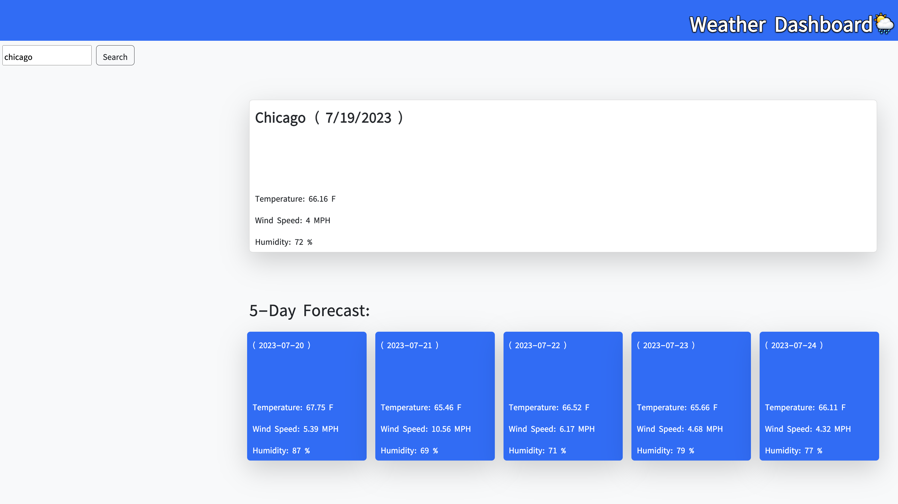

# Weather Dashboard ⛅️

## Challenge 6: Server-Side APIs

For this week's challenge, I created a weather dashboard that retrieves data from a third-party API using HTML, CSS, Javascript, Bootstrap, and the Open Weather API.

#

## User Story
AS A traveler
 
I WANT to see the weather outlook for multiple cities
 
SO THAT I can plan a trip accordingly

#

## Acceptance Criteria
- When I search for a city, I'm presented with current and future conditions for that city, and that city is added to the search history.
- When I view current weather conditions for that city, I'm presented with the city name, the date, an icon representation of weather conditions, the temperature, the humidity, and the wind speed.
- When I view future weather conditions for that city, I'm presented with a 5-day forecast that displays the date, an icon representation of weather conditions, the temperature, the wind speed, and the humidity.
- When I click on a city in the search history, I'm presented with current and future conditions for that city.

#

Link to deploy application: https://lizf57.github.io/weather-app/ 

## Mock-Up

## Resources

- Open Weather API
    https://openweathermap.org/api 
